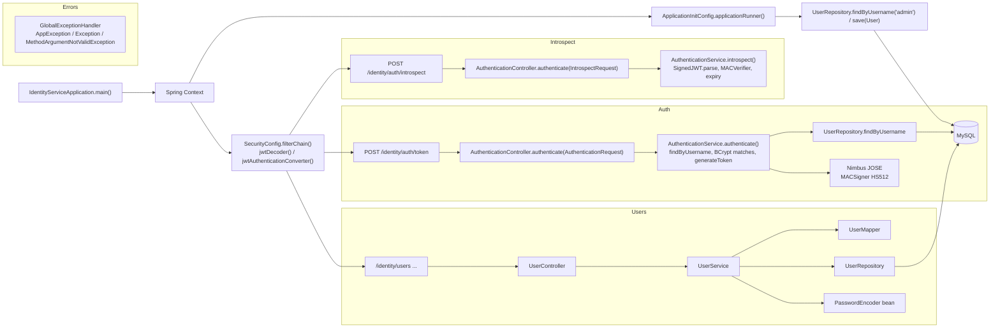
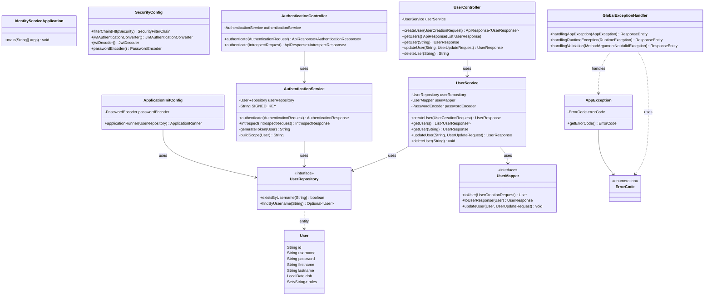

# Identity Service — sơ đồ kiến trúc (Notion)

**Context path:** `/identity` (xem `application.yaml`).

## Cách đưa vào Notion

1. **Import Markdown:** Trong Notion: `⋯` trên trang → **Import** → chọn **Markdown** → upload file này.  
   Nếu khối Mermaid không tự vẽ, làm bước 2.
2. **Dán từng sơ đồ:** Tạo khối **Code** → đổi ngôn ngữ thành **Mermaid** → dán nội dung *bên trong* fence (chỉ phần `flowchart` / `classDiagram`, không dán dòng ` ```mermaid `).

---

## 1. Luồng request (flowchart)



---

## 2. Class & phụ thuộc chính (class diagram)



---

*Tệp được tạo để import hoặc dán vào Notion; nội dung Mermaid tương thích trình vẽ Mermaid trong Notion.*
